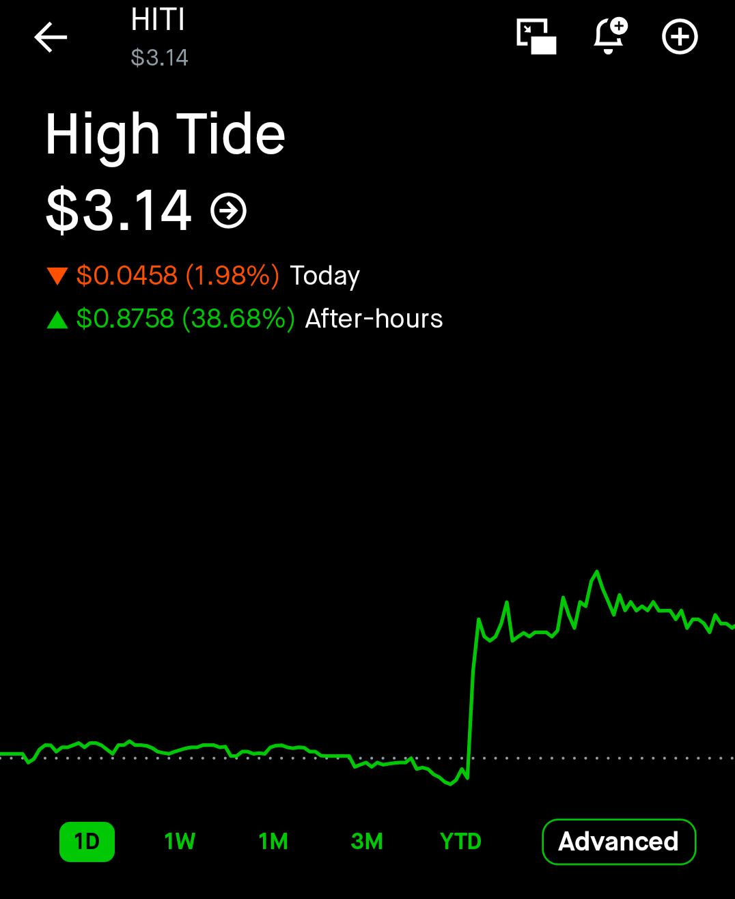

# Monday Night
*June 15, 1996 -- Charleston, Mississippi*

---

The option was showing $0.13.

Baxter knew why that number felt wrong to Patrick even though it wasn't. He had known since 4:03 PM, when the market closed and HITI printed $2.25 on the last tick and the option chain locked in place -- just stopped, mid-thought, like someone pulling a plug. Four contracts at $0.13 each. $52 recovered of the $100 they had put in. Down $48, down 48%, the kind of number that looks like a slow-motion mistake when you don't understand what's happening on the other side of it.

The stock, though.

The stock was a different conversation entirely.

---

He had been tracking HITI since 11 AM, when the earnings came out. That was the first surprise -- they were supposed to report after close, and instead the press release hit the wire at 11:17 AM Eastern while the market was still running. He had refreshed the page twice to make sure he was reading it right.

*Record revenue of C$179.3 million.*

He wrote it down. Then he wrote down what the analysts had expected.

*Expected: $125.9 million.*

He stared at that for a long time. Forty-two percent above consensus. EBITDA of $13.9 million. The insiders who had bought 90,882 shares in May at $3.39 -- the same people who ran the company, who sat in the same rooms where the quarterly numbers were being built -- had been sitting on a position that knew this was coming. Not insider trading. Just competence. Just the knowledge of what you are building before anyone else can see it finished.

The stock had not known what to do with itself. It had spiked to $2.61 in the first hour, then faded through the afternoon, uncertain, and closed at $2.25. Thirty-two cents below their strike. The option finished the day at $0.13 -- time value bleeding out on a contract that was out of the money at close, down 48% from entry. Patrick was going to look at his Robinhood and think they had lost everything.

Then the after-hours feed started moving.

---

$2.30.

$2.44.

$2.52.

Baxter pulled up the earnings release again and read it more carefully this time. Northern Helm acquisition -- four stores, $7.74 million, 4.5x EBITDA. Forty percent cash, sixty percent HITI shares. Dilutive. Not the story. The story was $179.3 million against $125.9 million expected, and whoever was buying HITI at 4:05 PM had done the same math he was doing right now and arrived at the same place.

$2.65.

$2.74.

He got out a clean sheet of paper and wrote the table. If the option opened at $0.40, four contracts was $160. If it opened at $0.45, four contracts was $180. If it opened at $0.50, four contracts was $200. They had paid $100.

$2.88.

He circled $0.45 on the paper. Then he circled $0.50.

The option was still showing $0.13 on the screen -- the last traded price from when HITI was at $2.25 and the contract was sitting out of the money. He understood this. The options market was closed. The options market did not care what HITI was doing in after-hours trading. The options market would reopen at 9:30 AM tomorrow, look at where the stock was actually trading, and price the $2.50C accordingly. Whatever the stock opened at tomorrow morning was the number that mattered. Tonight's $2.88 was a signal, not a settlement.

He wrote it on the paper anyway. *$2.88 AH.*

Then the phone rang.

---

He picked up on the second ring.

"Baxter." Patrick's voice was tight in that particular way -- not panicked, but on the edge of needing a very clear explanation very quickly. "It looks to me like HITI reported earnings while the market was still open. And -- I'm so confused -- HITI is at $2.88 right now. But our contract is showing as basically worthless."

Baxter had the paper in front of him. He had been waiting for this call for about forty minutes.

"Stop. The option is fine."

"It's showing --"

"I know what it's showing. Options don't trade after hours. What you're seeing on the contract is the last price from when the market closed, and when the market closed, HITI was at $2.25. Our strike is $2.50. The option was out of the money at close, so it shows $0.13 and you're down 48% on the position. That's correct. That's what correct looks like when the underlying is below the strike at 4 PM."

Silence on the other end. Baxter could hear Patrick processing it.

"The $2.88 you're seeing right now is after-hours trading on the stock. The options market is closed. It will not update until 9:30 tomorrow morning."

"So the option isn't --"

"The option is fine. Here's what actually happened today." Baxter looked at the paper. "HITI reported record revenue of $179.3 million. Analysts expected $125.9 million. That's a forty-two percent beat. EBITDA of $13.9 million. The insiders who bought at $3.39 in May -- the ones we flagged as the signal that was working in our favor -- they knew this quarter was coming. The stock went to $2.61 in the morning and then faded and closed at $2.25, which is why the option looks worthless right now. Then after-hours it moved to $2.88 on people doing the same math we are."

"So if it opens at $2.88 tomorrow --"

"If it opens at $2.88, we're $0.38 in the money with 32 days of time value left. The option opens at somewhere around $0.45 to $0.60. We entered at $0.25."

Another pause. Baxter waited.

"So --" Patrick started doing it, he could hear it -- "$0.45 times four contracts --"

"Four contracts at $0.45 is $180. You paid $100. That's plus $80. Eighty percent return on the position."

He heard Patrick exhale.

"The exit rule does not move," Baxter said. "We sell at open June 16. 9:32 AM -- not 9:30:00, because the spreads on an illiquid options contract are going to be ugly in the first ninety seconds. We wait two minutes for the market makers to settle their quotes. Then we look at the bid, we place a limit at the bid, and we close it. Whatever 9:32 gives us is what we take."

"Not a market order."

"Not a market order. Not on this. The spread could be $0.20 wide. A market order on an illiquid options contract after a gap is how you leave forty dollars on the table."

"Okay." Patrick sounded steadier now. "Set two alarms?"

"Set two alarms. One for 9:25 so you're ready. One for 9:30 so you move."

"Got it."

Baxter looked at the stock feed. $2.88 was holding.

"Patrick. Don't touch anything tonight."

"Yeah." A beat. "Baxter -- we might actually make money on this one."

"We might," Baxter said. "We'll know at 9:32."

He set the phone down.

---

The screen was still showing $0.13 on the option and $2.88 on the stock, and both numbers were correct for different reasons, and that was the thing about options that most people never figured out -- the instrument and the underlying lived in different clocks, and tonight the stock had moved forward four hours into tomorrow while the option was still waiting at 4 PM where it had been left. Down 48% on the screen. The stock up 27.20% after hours. The gap between those two numbers was the entire thesis.

He set two alarms on his watch. 9:25. 9:30.

Then he looked at the island math on page one of the binder, the same page he had looked at in eighth grade when the number had seemed impossible and still seemed impossible but in a different way now -- less like a wall and more like a distance. You could not see the other side of a distance. You just had to keep moving and trust the math.

The fund was up $137 realized.

Tomorrow morning it might be $217.

He closed the binder.

---

*End of Monday session.*

---

## Tuesday Morning

The alarm went off at 9:25.

Michael checked HITI before he was fully awake. $2.58. Not $3.14. The stock had run to $3.14 somewhere in the night -- he'd seen it before he fell asleep, that green spike on the chart like a heartbeat monitor catching something -- and now it was $2.58 in pre-market and the option was showing a bid of $0.20.

He set the limit at $0.27.

It didn't fill.

He dropped it to $0.24.

It didn't fill.

The spread was $0.20 bid, $0.30 ask. The market maker wasn't moving. At 9:36 he dropped the limit to $0.22 and it filled. $88 recovered on $100 at risk. Loss of $12.

He sat with that for a minute. Last night the number on the screen had been $3.14. This morning it was $0.22.

The exit rule existed for this exact morning. He knew that. The rule was written before entry because the people who write rules after entry are the people who hold through the fade waiting for the number to come back. He had $88. That was real. $3.14 at 11 PM was not a price -- it was a possibility, and possibilities don't fill limit orders.

By the time he checked again, HITI was at $2.48. Below the strike. The option would have been nearly worthless.

The rule held.

---

## The Screen -- Last Night vs. This Morning

*This is what it looked like at 11 PM. The stock ran to $3.14 after hours -- +38.68% on the earnings beat.*

*This is what the position looked like before the call.*

*This is what the option looked like.*

**Final result:** Sold at $0.22. $88 recovered. -$12 on the position.
HITI at $2.48 by mid-morning. Below the $2.50 strike. Option would have approached zero.

The exit rule was right. It usually is.

*This is what Patrick saw when he called. Stock up $0.62 after hours. Option down $48. Both numbers correct.*

**HITI $2.88** | -$0.05 (-1.98%) today | **+$0.62 (+27.20%) after hours**
Option value: $52.00 ($0.13/contract) | Today's return: -$28.00 (-35%) | Total return: **-$48.00 (-48%)**

*This is the first night in the fund's history where we went to sleep not knowing if we were selling a winner or a loser at open. Get a screenshot tomorrow after the sale.*
