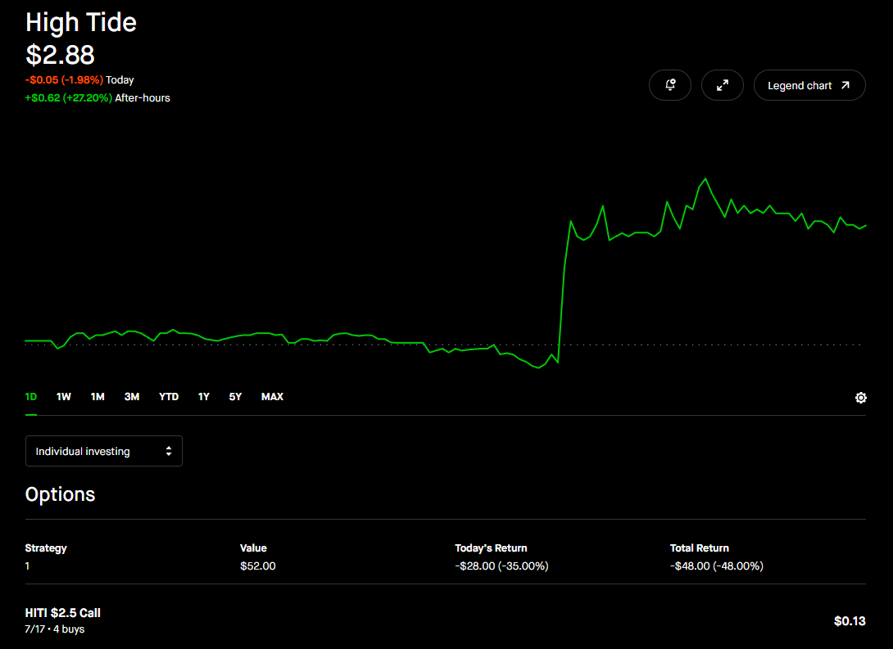
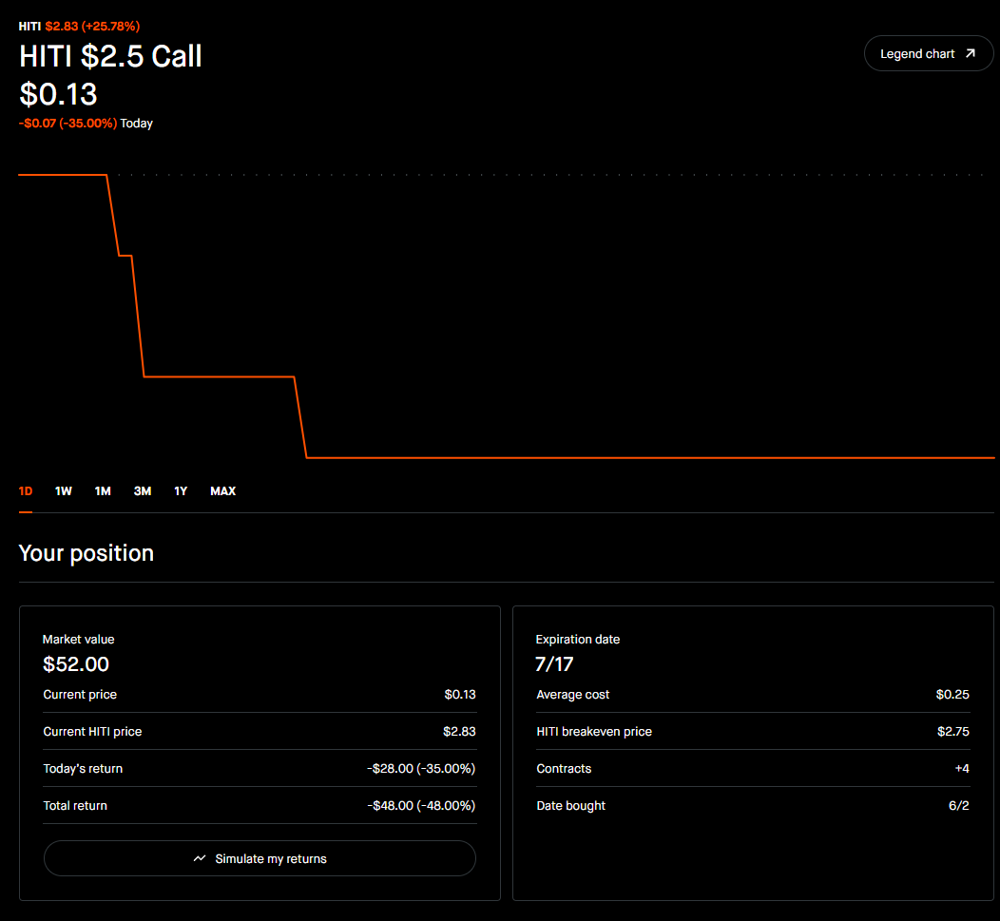

# Reddit Intro Post -- Draft
*Direxter. Status: READY TO POST TONIGHT. Drop result as a comment after 9:32 AM tomorrow.*
*Target: r/smallstreetbets | Flair: Discussion*

---

## TITLE

`Our option is down 48%. The stock just beat earnings by 42%. We sell at open either way.`

---

## POST BODY

---

The option is sitting at $0.13. We paid $0.25. Down 48% on the screen.

The stock is at $2.83 after hours. Up 27% tonight. The company just reported revenue of $179M against analyst expectations of $126M.

We sell at 9:32 AM regardless. That rule was written before we entered. It doesn't move.

---

We've been running a small options fund for 3 weeks. $500 to start. The goal is $5M -- enough to buy a private island and never work again. We call it the Island Fund. We're 17. The math checks out.

The system has 5 Iron Rules: stock in the bottom 20-25% of its 52-week range, earnings catalyst before expiry, near-zero sell ratings, lowest bull analyst target above our breakeven, option ask under $1.00. Before any trade gets approved it runs through a 5-character internal debate. Each character is a different part of the analysis -- the believer, the skeptic, the math, the macro, the integrated call. They don't always agree.

**Three weeks in:**

| Trade | Result | Why |
|---|---|---|
| DKNG $27.5C | +$251 (+512%) | Sold World Cup Day 2. Thesis window closed. |
| MDT $85C | +$23 (+52%) | Catalyst already fired. Cut at the right time. |
| NKE $50C | -$70 | RBC downgraded the specific catalyst we were holding for. Cut it. |
| BSX $60C | -$15 | Bear floor dropped below our breakeven the day we entered. Should have exited same day. We waited 2 days. Lesson written down. |
| HITI $2.5C x4 | **pending** | See below. |

The losses are in there because the losses are part of the record.

---

Tonight is HITI -- High Tide Inc, a Canadian cannabis retailer. We hold 4 contracts of the $2.50 call expiring July 17. $100 at risk. Entry June 2.

The thesis: insiders bought 90,882 shares in May at $3.39 when the stock was already in the bottom 5% of its 52-week range. The people running the company thought it was worth $3.39. The exit rule: sell at open the morning after earnings, no exceptions.

Earnings came out today. Revenue: $179M. Analyst consensus: $126M. A 42% beat.

The stock closed at $2.25 -- below our $2.50 strike. Our option spent the day in the red. Options don't trade after hours. So right now, at 11 PM, the option is showing $0.13 -- down 48% from our $0.25 entry.

The stock is at $2.83 after hours.

If HITI opens near $2.83 tomorrow, the option opens in the money. $0.13 becomes something else. We don't know what. We find out at 9:30 AM.

We sell at 9:32. Limit order at the bid. No market orders on illiquid options after a gap. Whatever the bid says, that's what we take.

Two alarms set. One for 9:25, one for 9:30.

We find out at 9:32.

---

We'll be posting here -- the research, the debates, the nights like this one. This is the beginning.

---

*Direxter notes: Post tonight as-is. Tomorrow at 9:32 after the exit, drop the result as a TOP-LEVEL COMMENT -- option price at fill, total return, one line on how it felt. Everyone who engaged overnight gets the notification. Do not edit the post body.*
